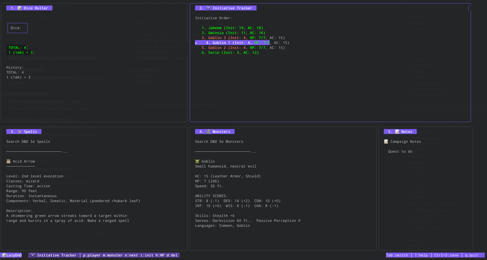
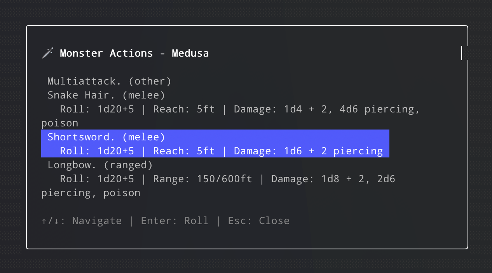
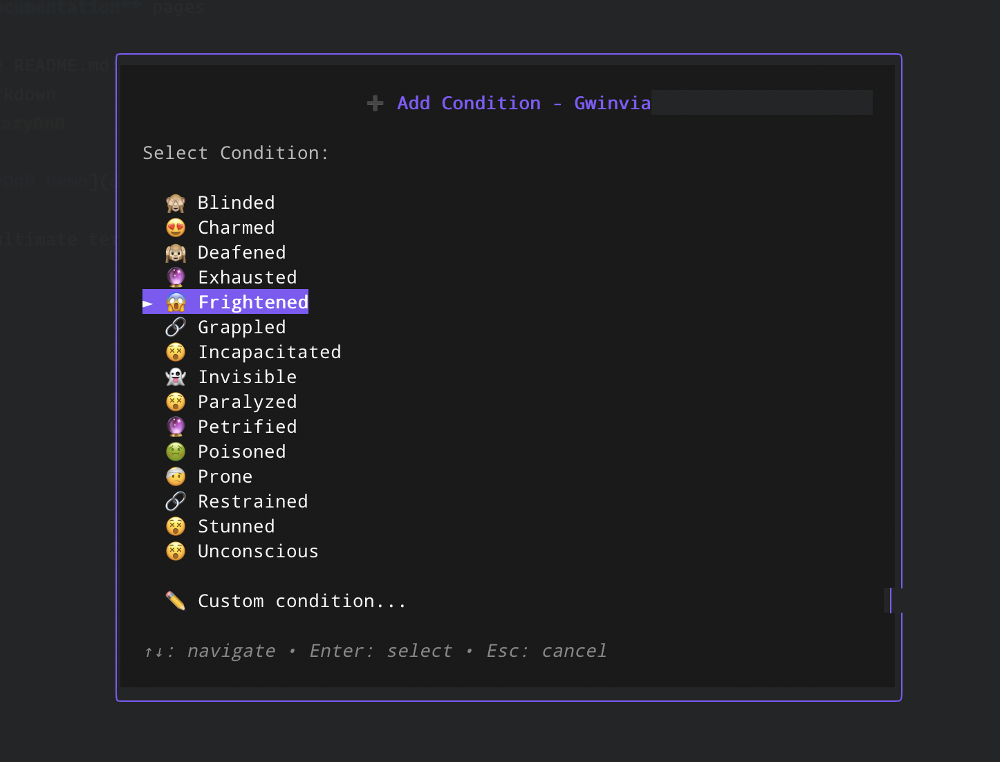
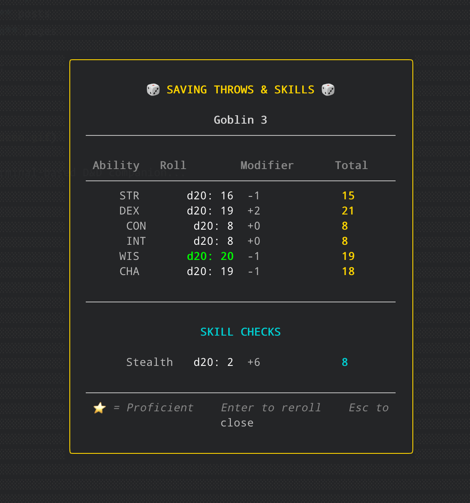
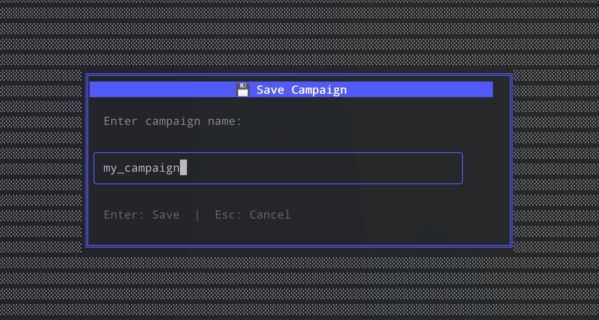

# LazyD&D - Terminal-based D&D Panel System for Dungeon Master

A lazygit-inspired terminal UI for managing your D&D game sessions, built with Go and Bubble Tea.



## Features

🎲 **Dice Roller Panel** - Roll any dice with simple commands (2d6, 1d20+5, etc.)
⚔️ **Initiative Tracker Panel** - Manage combat initiative for players and monsters
🎨 **Color-Coded HP** - HP display changes color based on health (green/orange/red)
✨ **Spells Panel** - Search and browse D&D 5e spells with fuzzy search
🐲 **Monsters Panel** - Search and view detailed monster stat blocks with fuzzy search
💾 **Campaign Save/Load** - Save your game state and resume later
🔄 **Auto-Save** - Automatic saving every 5 minutes
🔗 **Monster Integration** - Link monsters to initiative with full action support
⚡ **Instant Transitions** - Lightning-fast panel switching with zero latency
❌ **UI Error Messages** - Clear error notifications displayed in the UI, not just terminal

## Installation

### Docker (Easiest)

**Run with Docker (no installation needed):**
```bash
docker run -it --rm ghcr.io/zingazzi/lazydnd:latest
```

**Or build locally:**
```bash
git clone https://github.com/zingazzi/lazydnd
cd lazydnd
./docker-build.sh
./docker-run.sh
```

See [DOCKER.md](DOCKER.md) for detailed Docker documentation.

### Quick Install (Recommended)

**One-line installer (Linux/macOS):**
```bash
curl -sSL https://raw.githubusercontent.com/zingazzi/lazydnd/main/install.sh | bash
```

Or download and run the installer:
```bash
curl -O https://raw.githubusercontent.com/zingazzi/lazydnd/main/install.sh
chmod +x install.sh
./install.sh
```

### Manual Installation

Download the latest release for your platform from the [Releases page](https://github.com/zingazzi/lazydnd/releases/latest):

**Linux (Intel/AMD):**
```bash
curl -L -o lazydnd https://github.com/zingazzi/lazydnd/releases/latest/download/lazydnd-linux-amd64
chmod +x lazydnd
sudo mv lazydnd /usr/local/bin/
```

**Linux (ARM):**
```bash
curl -L -o lazydnd https://github.com/zingazzi/lazydnd/releases/latest/download/lazydnd-linux-arm64
chmod +x lazydnd
sudo mv lazydnd /usr/local/bin/
```

**macOS (Intel):**

```bash
curl -L -o lazydnd https://github.com/zingazzi/lazydnd/releases/latest/download/lazydnd-macos-amd64
chmod +x lazydnd
sudo mv lazydnd /usr/local/bin/
```

**macOS (Apple Silicon):**
```bash
curl -L -o lazydnd https://github.com/zingazzi/lazydnd/releases/latest/download/lazydnd-macos-arm64
chmod +x lazydnd
sudo mv lazydnd /usr/local/bin/
```

**Windows:**
Download `lazydnd-windows-amd64.exe` from the [Releases page](https://github.com/zingazzi/lazydnd/releases/latest) and add it to your PATH.

### Build from Source

```bash
git clone https://github.com/zingazzi/lazydnd
cd lazydnd
go build -o lazydnd
./lazydnd
```

### Cross-Platform Build

Build executables for all platforms:
```bash
./build.sh
```

This creates executables in the `build/` directory for:
- Linux (amd64, arm64)
- macOS (amd64, arm64)
- Windows (amd64)

## Configuration

LazyDnD uses a configuration file at `~/.config/lazydnd/config.json` that allows you to customize:

- **Theme colors** - Primary, border, highlight, error, and success colors
- **Save directory** - Custom location for campaign saves
- **Auto-save settings** - Enable/disable and interval
- **Dice roller** - History size, minimum value, show individual rolls
- **Initiative tracker** - Auto-sort, show HP/AC, round counter
- **Display** - Help hints, compact mode, line wrapping
- **Backups** - Enable/disable, location, maximum backups

**Example: Custom save location**
```json
{
  "paths": {
    "save_directory": "~/Documents/DnD/LazyDnD",
    "backup_enabled": true,
    "max_backups": 15
  }
}
```

See [CONFIGURATION.md](CONFIGURATION.md) for complete configuration documentation and examples.

## Usage

### Command Line Options

```bash
lazydnd           # Start the application
lazydnd --version # Print version number and exit
lazydnd --debug   # Enable debug logging to ~/.config/lazydnd/debug.log
lazydnd --help    # Show available options
```

**Debug Mode:**
When enabled with `--debug`, the application logs all events to `~/.config/lazydnd/debug.log` including:
- Key presses and handlers
- Multi-target operations
- Condition additions/removals
- Spell tracking events
- State changes

Useful for troubleshooting issues. You can view the log in real-time with: `tail -f ~/.config/lazydnd/debug.log`

**Fuzzy Search:**
Both Monsters and Spells panels now use intelligent fuzzy search that:
- Handles typos and misspellings (e.g., "frbl" finds "Fireball")
- Matches partial names in any order (e.g., "drag red" finds "Adult Red Dragon")
- Automatically sorts results by match quality
- More forgiving than exact substring matching
- Just start typing to see suggestions!

**Level/CR Filters:**

**CR Filter (Monsters Panel):**
Browse monsters by Challenge Rating with autocomplete:
1. Press `f` in the Monsters panel to open CR filter
2. Type a CR value as you type, monsters matching that CR appear instantly:
   - **Exact**: `5` → shows all CR 5 monsters
   - **Range**: `0-5` → shows CR 0 through 5
   - **Minimum**: `10+` → shows CR 10 and above
   - **Fractional**: `1/4`, `1/2`, `0.5` all work!
3. Use `↑↓` arrow keys to navigate the list
4. Press `Enter` to select a monster and view its full details
5. Press `Esc` to cancel and go back
6. Perfect for finding level-appropriate encounters quickly!

**Spell Level Filter (Spells Panel):**
Browse spells by spell level with autocomplete:
1. Press `f` in the Spells panel to open level filter
2. Type a spell level, spells matching that level appear instantly:
   - **Exact**: `3` → shows all 3rd-level spells
   - **Range**: `0-2` → shows cantrips through 2nd-level
   - **Minimum**: `5+` → shows 5th-level and higher
3. Use `↑↓` arrow keys to navigate the list
4. Press `Enter` to select a spell and view its full details
5. Press `Esc` to cancel and go back
6. Great for finding spells your character can cast!

### Global Navigation & Controls

#### Panel Navigation
| Key | Action |
|-----|--------|
| `1-4` or `F1-F4` | Jump directly to specific panel |
| `Tab` | Cycle forward through panels |
| `Shift+Tab` | Cycle backward through panels |
| `↑` `↓` | Navigate lists and scroll content |
| `Esc` | Cancel input or exit current mode |
| `?` | Show help popup with all keybindings |
| `q` or `Ctrl+C` | Quit application |

#### Campaign Management
| Key | Action |
|-----|--------|
| `Ctrl+S` | Save campaign (quick save if already saved, or open save dialog) |
| `Ctrl+L` | Load campaign (shows list of saved campaigns) |
| `Ctrl+N` | Rename current campaign |

**Campaign Features:**
- 💾 **Auto-Save**: Campaigns automatically save every 5 minutes
- 📁 **Save Location**: All campaigns stored in `~/.lazydnd/`
- 📊 **Status Bar**: Shows current campaign name and last save time
- 🔄 **Full State**: Saves entire initiative tracker with all monster links

---

### Panel-Specific Features

#### 🎲 Panel 1: Dice Roller

**Keybindings:**
| Key | Action |
|-----|--------|
| `Enter` | Start dice input mode |
| `r` | Reroll last command |
| Type dice notation and press `Enter` | Roll dice |

**Dice Notation Examples:**
- **Simple Rolls**: `1d20`, `2d6`, `3d8`, `4d10`
- **With Modifiers**: `2d6+3`, `1d20-1`, `1d8+5`
- **Multiple Dice**: `2d8+3d6`, `1d6-1d4`, `2d8+3d6-1d4`
- **Complex Expressions**: `1d6+3+2d8-5`, `2d6-1d4+3`
- **Comma-Separated**: `1d8+3, 3d6-1` (rolls multiple expressions)
- **Advantage/Disadvantage**: `1d20 adv`, `2d6 dis`

**🔥 Preset Spell Macros (35+ Built-in):**
Just type the spell name and press Enter:
- **Cantrips**: `eldritch_blast`, `fire_bolt`, `toll_the_dead`
- **Popular Spells**: `fireball`, `lightning_bolt`, `magic_missile`, `cure_wounds`
- **High-Level**: `disintegrate`, `chain_lightning`, `finger_of_death`
**🎯 Custom Macros:**
- Create: `my_attack=1d20+5`
- Execute: `my_attack`
- Skill Checks: `stealth`, `perception+5` (for selected character)
- Group Initiative: `group` (rolls init for all monsters)

See [PRESET_MACROS.md](PRESET_MACROS.md) for full list!

**Features:**
- ✅ Minimum value of 1 (D&D rule)
- ✅ Standard D&D dice: d4, d6, d8, d10, d12, d20, d100
- ✅ Zocchi's dice: d3, d5, d7, d14, d16, d24, d30
- ✅ Roll history displayed
- ✅ Quick reroll with 'r' key

---

#### ⚔️ Panel 2: Initiative Tracker



**Keybindings:**
| Key | Action |
|-----|--------|
| `p` | Add player to initiative (name, initiative, AC) |
| `m` | Add monster manually (name, HP, AC, initiative) |
| `Enter` | Enter edit mode (navigate entries with ↑↓) |
| `n` | Next turn (advance initiative) |
| `x` | Reset combat (reset turn and round counters) |
| `Ctrl+Z` | Undo HP change (up to 3 actions) |
| `Ctrl+Y` | Redo HP change |
| `i` | Edit initiative value (in edit mode) |
| `h` | Edit HP - add/remove HP with +/- (in edit mode) |
| `H` | Edit Max HP - set new maximum HP value (in edit mode, monsters only) |
| `T` | Set Temp HP - Shift+T to set temporary hit points (in edit mode, monsters only) |
| `t` | Multi-target damage/healing mode |
| `o` | Manage conditions (add/remove status effects in edit mode) |
| `s` | Roll saving throws & skill checks (in edit mode, monsters only) |
| `d` | Delete selected entry (in edit mode) |
| `l` | View linked monster details (if added from Monster panel) |
| `a` | Show monster actions popup (if monster has actions) |
| `c` | Copy/duplicate selected entry |

**Features:**
- ✅ **Turn Tracking**: Track current turn with visual indicator (★)
- ✅ **Round Counter**: Automatic round tracking with time elapsed (6 seconds per round)
- ✅ **Auto-Sort**: Entries sorted by initiative (highest first)
- ✅ **Player AC Tracking**: Track Armor Class for both players and monsters
- ✅ **Conditions Tracker**: Add/remove status effects (Poisoned, Stunned, etc.) with duration tracking
- ✅ **Monster Linking**: Monsters added from Monster panel retain full data
- ✅ **Action Integration**: Press 'a' on linked monsters to see available actions
- ✅ **Quick Actions**: Select action to auto-roll damage in Dice Roller
- ✅ **Saving Throws & Skills**: Press 's' to roll all saves and skill checks for monsters
- ✅ **HP Tracking**: Real-time HP management for monsters
- ✅ **Max HP Editing**: Adjust maximum HP values for monsters (Shift+H)
- ✅ **Color-Coded HP**: HP changes color - Green (> 50%), Orange (25-50%), Red (< 25%)
- ✅ **Temporary HP**: Track temp HP separately, displayed in cyan (+5)
- ✅ **Undo/Redo**: Undo up to 3 HP changes with Ctrl+Z, redo with Ctrl+Y
- ✅ **Duplicate Monsters**: Copy entries with automatic numbering (Goblin 1, Goblin 2, etc.)
- ✅ **Multi-Target Damage/Healing**: Apply damage or healing to multiple targets simultaneously
- ✅ **Campaign Save**: All initiative data saved with campaign



**Conditions Tracker:**
Track status effects (Poisoned, Stunned, Paralyzed, etc.) on any creature:
1. **Conditions show inline in initiative list** with emoji icons (e.g., "Goblin 1 (HP: 7/7, AC: 13) 🤢😱")
2. Hover/select to see full details: names and remaining rounds
3. Press `Enter` to enter edit mode, navigate to an entry with `↑↓`
4. Press `o` to open conditions manager
5. View detailed list with duration countdown (e.g., "🤢 Poisoned (3 rounds)")
6. Press `a` to add a new condition
7. Select from list of 15 common D&D conditions using `↑↓` (or choose "Custom condition..." for your own)
8. Press `Enter` to confirm selection
9. Enter duration in rounds (or 0 for indefinite)
10. Press `Enter` to apply
11. Press `d` to remove a condition from the list
12. Conditions automatically expire after duration ends and disappear from the list

**Multi-Target Conditions:**
Apply conditions to multiple creatures at once (e.g., Fear spell affecting 3 enemies):
1. Press `t` to enter multi-target mode
2. Use `Space` to select multiple targets
3. Press `o` to open condition manager (shows "X targets selected")
4. Press `a` to add condition
5. Select condition and duration
6. Condition applies to all selected targets simultaneously!

**Common Conditions with Emojis:**
🤢 Poisoned • 😵 Stunned/Paralyzed/Incapacitated/Unconscious • 😱 Frightened • 😍 Charmed • 👻 Invisible • 🤕 Prone • 🔗 Grappled/Restrained • 🙈 Blinded • 🙉 Deafened • 🔮 Others

**Multi-Target Damage/Healing:**
Perfect for area spells (Fireball, Thunderwave) and mass healing:
1. Enter edit mode with `Enter`
2. Press `t` to enter multi-target mode
3. Use `Space` to select/deselect targets (checkboxes appear: [✓])
4. Press `Enter` to open the damage/healing popup
5. Enter amount:
   - Type `-28` for 28 damage (automatically sets damage mode)
   - Type `+10` for 10 healing (automatically sets healing mode)
   - Or type plain `28` and use `h` to toggle between damage/healing
6. **Optional**: Press `x` to toggle save mode
   - When save mode is ON, mark each target as success (`s`) or failure (`f`)
   - Successful saves take half damage
7. Press `Enter` to apply to all selected targets
8. Press `Esc` or `t` to exit multi-target mode

**Example: Fireball spell hitting 3 goblins**
- Select all 3 goblins with Space
- Enter `-28` (for 28 damage)
- Enable save mode with `x`
- Mark saves: Goblin 1 fails (f), Goblin 2 succeeds (s), Goblin 3 fails (f)
- Apply: Goblin 1 takes 28 damage, Goblin 2 takes 14 damage, Goblin 3 takes 28 damage

**Example: Mass Healing Word on 3 party members**
- Select all 3 party members with Space
- Enter `+7` (for 7 healing)
- Apply: All 3 party members gain 7 HP

**HP Management:**
LazyDnD provides flexible HP tracking for monsters with two editing modes:

1. **Edit Current HP** (press `h`):
   - Enter edit mode (`Enter`), select a monster, press `h`
   - Enter HP change with `+` to heal or `-` to damage
   - Examples: `-15` (take 15 damage), `+8` (heal 8 HP)
   - Current HP automatically capped at 0 and maximum HP
   - Tracks up to 3 actions in undo history (Ctrl+Z to undo)

2. **Edit Maximum HP** (press `H` / Shift+H):
   - Enter edit mode (`Enter`), select a monster, press `H`
   - Enter new maximum HP value (absolute value, minimum 1)
   - Example: `150` sets max HP to 150
   - Current HP is automatically capped if it exceeds the new maximum
   - Useful for adjusting monster difficulty or fixing entry mistakes

**Color-Coded HP:**
Monster HP is displayed with color coding for quick health assessment:
- **Green** (> 50% HP): `HP: 10/10` - Healthy, full combat effectiveness
- **Orange** (25-50% HP): `HP: 4/10` - Bloodied, wounded but still dangerous
- **Red** (< 25% HP): `HP: 2/10` - Critical, near death

The HP text changes color based on the monster's health percentage, making it easy to see which enemies are weakened at a glance. Perfect for tactical decision-making during combat!

**Temporary HP:**
Track temporary hit points separately from regular HP following D&D 5e rules:
- **Display**: `HP: 25/30 +5` - Temp HP shown in **cyan** color
- **Damage Absorption**: Temp HP is always lost first before real HP
- **Non-Stacking**: Setting new temp HP replaces existing (doesn't add)
- **Set Temp HP**: Press `Shift+T` in edit mode, enter value (0 to clear)
- **Healing**: Healing only affects real HP, not temp HP
- **Persistence**: Temp HP saved with your campaign

**Example:**
- Goblin has `HP: 7/7 +3`
- Takes 5 damage → Loses 3 temp HP, 2 real HP → Now `HP: 5/7`
- Takes 2 damage → Now `HP: 3/7`

**Adding Players and Monsters:**
1. **Add Player**: Press 'p' and enter:
   - Player name
   - Initiative value
   - Armor Class (AC)
2. **Add Monster Manually**: Press 'm' and enter:
   - Monster name
   - Hit Points (HP)
   - Armor Class (AC)
   - Initiative value (or 'r' to roll)
3. **Add Monster from Panel**: Search in Monster panel, press 'a' to add with full stats and actions



**Saving Throws & Skill Checks:**
When a monster is added from the Monster panel, you can roll all saving throws and skill checks:
1. Enter edit mode with `Enter`
2. Select a monster with ↑↓
3. Press `s` to open the saving throws popup

The popup displays:
- ✅ **All 6 Saving Throws**: STR, DEX, CON, INT, WIS, CHA with correct modifiers
- ✅ **Proficiency Detection**: Automatically applies proficiency bonuses (marked with ⭐)
- ✅ **Stealth Check**: If monster has Stealth skill
- ✅ **Perception Check**: If monster has Perception skill
- ✅ **Natural 20/1 Highlighting**: Critical successes (green) and failures (red)
- ✅ **Reroll**: Press `Enter` to reroll all checks
- ✅ **Close**: Press `Esc` to close popup

**Example Use Cases:**
- Fireball spell → Check DEX saves for all monsters
- Hidden enemy → Roll Stealth check
- Surprise round → Check Perception against Stealth
- Hold Person spell → Check WIS save
- Legendary Resistance → Roll and decide if used

---

#### ✨ Panel 3: Spells

**Keybindings:**
| Key | Action |
|-----|--------|
| `Enter` | Start spell search |
| `f` | Filter by spell level (0-9, ranges like 0-3, 5+) |
| Type spell name | Real-time autocomplete suggestions |
| `↑` `↓` | Navigate spell suggestions |
| `Enter` | Select spell to view details |
| `c` | Cast selected spell (track duration) |
| `v` | View active spells |
| `d` | Delete active spell (in active spell view) |
| `Esc` | Exit search/active spell mode |

**Features:**
- ✅ **Complete D&D 5e Spell Database**
- ✅ **Real-time Autocomplete**: Suggestions appear as you type
- ✅ **Spell Level Filter**: Filter by exact level, ranges, or minimum (e.g., 0-2, 5+)
- ✅ **Full Details**: Level, school, casting time, range, components, duration, description
- ✅ **Class Information**: Shows which classes can cast the spell
- ✅ **Ritual & Concentration**: Clearly marked
- ✅ **Spell Tracking**: Cast and track spell durations during combat
- ✅ **Active Spell Management**: View and manage all active spells
- ✅ **Auto Duration Countdown**: Spells automatically expire as combat rounds progress

**Spell Tracking:**
When you cast a spell with a duration:
1. Search and select a spell with `Enter`
2. Press `c` to cast the spell
3. Enter the caster's name (e.g., "Gandalf", "Goblin 2")
4. The spell is added to active spells with duration tracking

**Active Spells:**
- Press `v` to view all active spells
- Shows spell name, caster, and time remaining
- Duration automatically decrements each round (when using `n` in Initiative Tracker)
- Press `d` to manually remove a spell
- Concentration spells are marked with (C)
- Active spells are saved with your campaign

**Duration Tracking:**
- Each combat round = 6 seconds
- Supports: rounds, minutes, hours, days
- Examples: "1 minute" = 10 rounds, "1 hour" = 600 rounds
- Instantaneous spells are not tracked
- Shows time in human-readable format (minutes, hours, etc.)

---

#### 🐉 Panel 4: Monsters

**Keybindings:**
| Key | Action |
|-----|--------|
| `Enter` | Start monster search |
| `f` | Filter by CR (exact, range like 0-5, or min like 10+) |
| Type monster name | Real-time autocomplete suggestions |
| `↑` `↓` | Navigate monster suggestions |
| `Enter` | Select monster to view stat block |
| `a` | Add selected monster to Initiative Tracker (with full actions) |
| `Esc` | Exit search mode |

**Features:**
- ✅ **8750+ D&D 5e Monsters**
- ✅ **Complete Stat Blocks**: AC, HP, Speed, Ability Scores, Saves, Skills
- ✅ **CR Filter**: Filter by exact CR, ranges, or minimum (e.g., 0-5, 10+)
- ✅ **Traits & Actions**: All special abilities and attacks
- ✅ **Legendary Actions**: Full legendary action details
- ✅ **Challenge Rating**: CR and XP values
- ✅ **Action Parser**: Structured action data with damage, reach, save DCs
- ✅ **Initiative Integration**: Press 'a' to add monster to initiative with all data linked

**Monster Actions:**
When a monster is added to initiative from the Monster panel:
- Press 'a' in Initiative Tracker to see action list
- Select action to automatically roll damage in Dice Roller
- Actions include: attack bonus, reach/range, damage dice, damage type, save DCs

**Custom Monsters:**
You can add your own custom monsters or override existing ones:

1. Create the custom monsters directory:
   ```bash
   mkdir -p ~/.config/lazydnd/custom_monsters
   ```

2. Add JSON files with the same structure as `assets/monsters.json`:
   ```bash
   # Create your custom monster file
   nano ~/.config/lazydnd/custom_monsters/my_monsters.json
   ```

3. LazyDND automatically loads all `.json` files from this directory on startup

**Custom Monster File Format:**
```json
[
  {
    "name": "My Custom Monster",
    "meta": "Large beast, neutral",
    "Armor Class": "15 (Natural Armor)",
    "Hit Points": "68 (8d10 + 24)",
    "Speed": "40 ft.",
    "STR": "18",
    "STR_mod": "(+4)",
    "DEX": "14",
    "DEX_mod": "(+2)",
    "CON": "16",
    "CON_mod": "(+3)",
    "INT": "3",
    "INT_mod": "(-4)",
    "WIS": "12",
    "WIS_mod": "(+1)",
    "CHA": "7",
    "CHA_mod": "(-2)",
    "Challenge": "3 (700 XP)",
    "Actions": "<p><em><strong>Bite.</strong></em> <em>Melee Weapon Attack:</em> +6 to hit, reach 5 ft., one target. <em>Hit:</em> 13 (2d8 + 4) piercing damage.</p>",
    "ActionNumber": 1,
    "ActionList": [
      {
        "name": "Bite",
        "type": "melee",
        "description": "Bite. Melee Weapon Attack: +6 to hit, reach 5 ft., one target. Hit: 13 (2d8 + 4) piercing damage.",
        "roll": "+6",
        "reach": "5ft",
        "damage": "2d8 + 4",
        "damage_type": "piercing"
      }
    ]
  }
]
```

**Notes:**
- Custom monsters with the same name as default monsters will override them
- Multiple JSON files can be placed in the directory
- Invalid JSON files will be skipped with a warning
- Example custom monsters are available at `~/.config/lazydnd/custom_monsters/example_custom_monsters.json` after first run

---

### Campaign Management Details



**Saving Your Campaign:**
1. Press `Ctrl+S` to save
2. Enter campaign name (e.g., "dragon_heist")
3. Campaign saved to `~/.lazydnd/dragon_heist.json`
4. Status bar shows: `📁 dragon_heist (💾 Just now)`

**Loading a Campaign:**
1. Press `Ctrl+L` to open load dialog
2. Use `↑` `↓` to navigate saved campaigns
3. Press `Enter` to load
4. All initiative data and monster links restored

**Renaming a Campaign:**
1. Press `Ctrl+N` (only available when campaign is loaded)
2. Enter new name
3. Old file deleted, new file created

**Auto-Save:**
- Automatically saves every 5 minutes when campaign is loaded
- Status bar shows time since last save: `💾 3m ago`
- Manual save with `Ctrl+S` updates to `💾 Just now`

**What Gets Saved:**
- ✅ All initiative tracker entries (players and monsters)
- ✅ HP, AC, initiative values
- ✅ Monster links (actions remain available after load)
- ✅ Instance numbers for duplicated monsters
- ❌ Dice history (session-specific)
- ❌ Current panel or scroll position

## Requirements

- Go 1.19 or higher
- Terminal with color support

## Dependencies

- [Bubble Tea](https://github.com/charmbracelet/bubbletea) - TUI framework
- [Lip Gloss](https://github.com/charmbracelet/lipgloss) - Styling

## Contribute

We welcome contributions! Whether it's bug fixes, new features, documentation, or suggestions, your help is appreciated.

**How to contribute:**
1. [Fork the repository](https://github.com/zingazzi/lazydnd/fork)
2. Create a new branch: `git checkout -b feature/your-feature`
3. Make your changes and commit: `git commit -am 'Add new feature'`
4. Push to your fork: `git push origin feature/your-feature`
5. [Open a Pull Request](https://github.com/zingazzi/lazydnd/pulls)

Please review the [PROJECT_STRUCTURE.md](./PROJECT_STRUCTURE.md) for code organization and best practices.

### Reporting Issues

If you find a bug, have a feature request, or need help:
- [Open an Issue](https://github.com/zingazzi/lazydnd/issues)
- Include clear steps to reproduce, expected behavior, and screenshots/logs if possible.

Thank you for helping improve LazyDnD!

## Enjoy LazyDnd? Buy me a coffee

If you find LazyDnD helpful, consider supporting development!
[☕ Buy me a coffee](https://www.buymeacoffee.com/zingazzi)
Your support helps keep the project alive and growing. Thank you!


## License

MIT License
