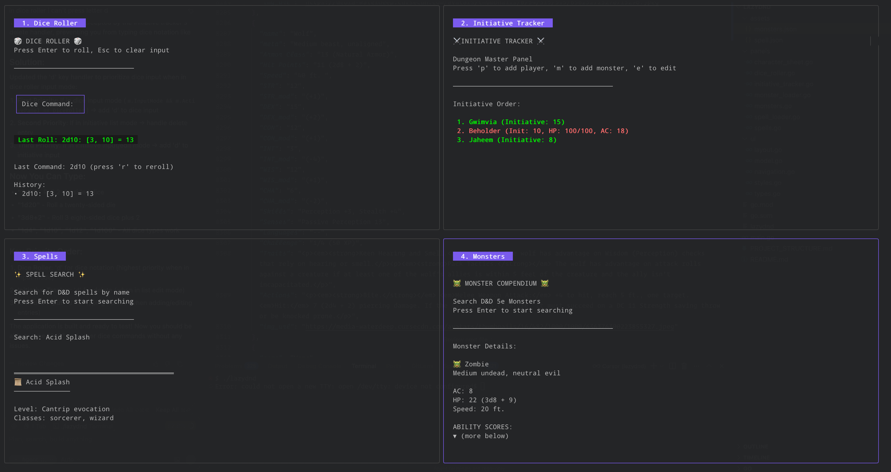

# LazyD&D - Terminal-based D&D Panel System for Dungeon Master

A lazygit-inspired terminal UI for managing your D&D game sessions, built with Go and Bubble Tea.



## Features

🎲 **Dice Roller Panel** - Roll any dice with simple commands (2d6, 1d20+5, etc.)
⚔️ **Initiative Tracker Panel** - Manage combat initiative for players and monsters
✨ **Spells Panel** - Search and browse D&D 5e spells with autocomplete
🐲 **Monsters Panel** - Search and view detailed monster stat blocks

## Installation

```bash
# Clone and build
git clone <your-repo>
cd lazydnd
go build -o lazydnd
./lazydnd
```

## Usage

### Navigation
- **Numbers 1-4** or **F1-F4**: Jump directly to panels
- **Tab**: Cycle through panels
- **↑↓**: Navigate lists and scroll content
- **Enter**: Activate input modes or select items
- **Esc**: Cancel input or exit modes
- **q**: Quit application

### Panel Features

#### 1. Dice Roller
- **Commands**: `1d20`, `2d6+3`, `3d8-1`, etc.
- **Available Dice**: d4, d6, d8, d10, d12, d20, d100
- **History**: View recent rolls
- **Reroll**: Press 'r' to reroll last command

#### 2. Initiative Tracker (Dungeon Master Panel)
- **Add Players**: Press 'p' → enter name and initiative
- **Add Monsters**: Press 'm' → enter name, HP, AC, and initiative
- **Edit Mode**: Press 'e' to edit existing entries
  - 'i': Edit initiative
  - 'h': Edit monster HP (+heal/-damage)
  - 'd': Delete entry
- **Auto-Sort**: Entries sorted by initiative (highest first)

#### 3. Spells Panel
- **Search**: Press Enter → type spell name
- **Autocomplete**: Real-time suggestions as you type
- **Details**: Full spell descriptions, components, duration, etc.
- **Database**: Complete D&D 5e spell compendium

#### 4. Monsters Panel
- **Search**: Press Enter → type monster name
- **Autocomplete**: Find monsters quickly
- **Stat Blocks**: Complete monster information including:
  - Ability scores and modifiers
  - AC, HP, Speed, Challenge Rating
  - Traits, Actions, Legendary Actions
- **Database**: 8750+ D&D 5e monsters

## Requirements

- Go 1.19 or higher
- Terminal with color support

## Dependencies

- [Bubble Tea](https://github.com/charmbracelet/bubbletea) - TUI framework
- [Lip Gloss](https://github.com/charmbracelet/lipgloss) - Styling

## License

MIT License
